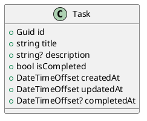

# Personal Task List Data Model

## Overview

The Personal Task List API uses one domain entity: `Task`.

`Task` represents a single item in the personal task list.

## PlantUML Diagram

## Validation Rules

- `id` is generated by the API, unique.
- `title` is required.
- `description` is optional. defaults to `null`.
- `isCompleted` defaults to `false` for new tasks.
- `createdAt`
- `updatedAt`
- `completedAt` is `null` until the task is completed.
- When a task is completed, `isCompleted` is set to `true`, `completedAt` is set to the completion timestamp, and `updatedAt` is updated.   